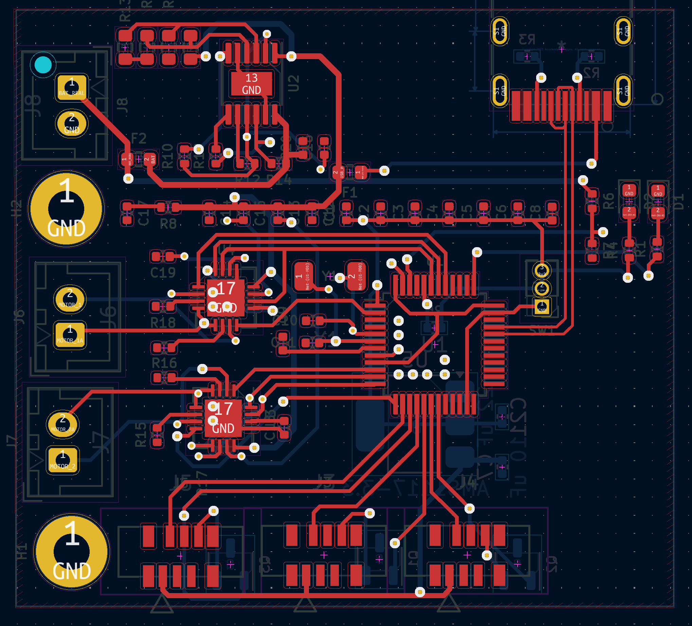
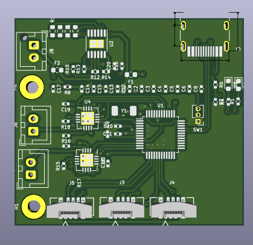

# TIME-II-PCB-REV-C
Radical Redesign of PCB for TIME II project of Space Technologies at Cal

## Features
- :computer: STM32 Microcontroller
- :hotsprings: Three FFC Plugs for Plate Heating System (Thermistors and Heaters)
- :gear: Two DRV8837 H-Bridge Motor Controllers
- :electric_plug: OR Gate PMIC for switching between USB and Battery Power
- :floppy_disk: SD Card for Data Logging

## Differences between Previous Revision

1. We received notice that we _may_ be able to use batteries outside of Blue Origin's approved battery list. 

Thus we decided to use lithium batteries which allowed the following simplifications:

- &nbsp;&nbsp;&nbsp;&nbsp; No longer support charging on flight
- Replaced buck converter with LDO as voltage drop is now 3.7V -> 3.3V instead of 5V -> 3.3V

2. The following simplifications were allowed due to mechanical design:
- Only support Brushed DC motors instead of supporting both DC motors and 3 pin servos
- Heater ports have been reduced from 5 to 3

3. The ESP32 microcontoller was replaced with an STM32, mostly to reduce board space since the WiFi and Bluetooth antennae that the ESP offers were unnecessary.

## Pictures

### Schematic
 

### Layout

## To-Do
- SD card footprint - Week of 3/10/24 [DONE]
- MOSI is connected to DAT0, MISO is connected to CMD. It should be: MOSI is connected to CMD, MISO is connected to DAT0.
- Sanity checks for wiring - week of 3/10/24
- Send board for manufacture - week of 3/10/24