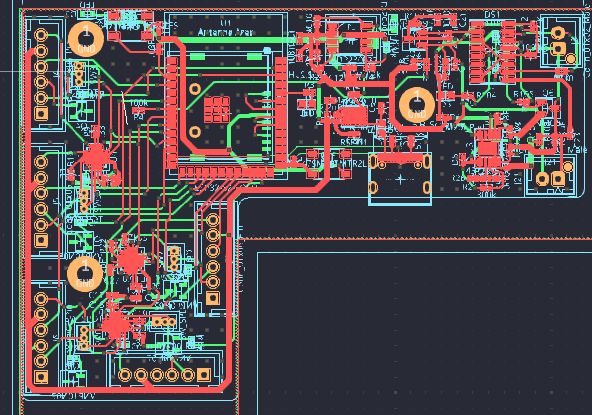

# TIME-II-PCB-REV-B
Second Revision of PCB for TIME II project of Space Technologies at Cal. The third and newest (as of 2024) revision is on branch radical. The first and oldest revision can be found [here](https://oshwlab.com/jbildy_1656/stac-time2).

## Features
- :computer: ESP32 Microcontroller
- :hotsprings: Five Plugs for Plate Heating System (Thermistors and Heaters)
- :gear: Three DRV8837 H-Bridge Motor Controllers
- :electric_plug: OR Gate PMIC for switching between USB and Battery Power
- :battery: On Flight AA Battery charging
- :floppy_disk: SD Card for Data Logging

## Differences between Previous Revision

1. Battery Support 
- Previous board had no way to switch between battery and rocket power, but battery power is required due to large wait time before launch when bacteria need to be heated.
- Current OR gate PMIC prioritizes rocket power when available and will switch to battery power when necessary.
- Since battery power is also required after the flight, this board attempts to implement on flight charging.

2. Servo and Motor Support
- To accommodate changes in mechanical design, this board supports both 3 pin servo and Brushed DC Motors.
- 3 pin servo's have largely been used for TIME II mechanical design, but the strict 500 gram weight limit might require plain DC motors.

3. The Arduino Microcontroller was replaced with an ESP32 to simplify the PCB design and bringup process.

## Pictures

### Schematic
 

### Layout

